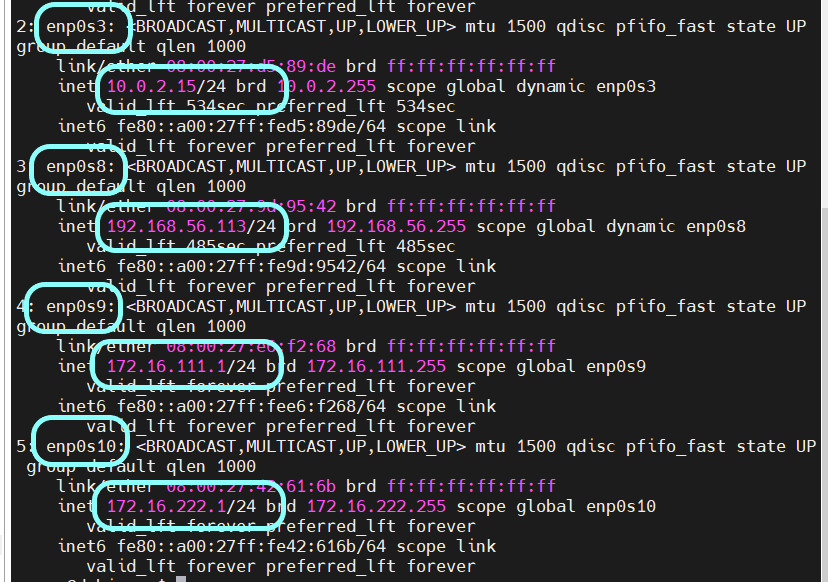

# 实验一 基于 VirtualBox 的网络攻防基础环境搭建

## 实验目的

* 掌握 VirtualBox 虚拟机的安装与使用；
* 掌握 VirtualBox 的虚拟网络类型和按需配置；
* 掌握 VirtualBox 的虚拟硬盘多重加载；

## 实验环境

* VirtualBox 虚拟机
* 攻击者主机（Attacker）：Kali Linux 2022.3
* 网关（Gateway/GW）：Debian Buster
* 靶机（Victim）： xp-sp3 / Kali /Debain

## 实验要求

* 虚拟硬盘配置成多重加载；
* 搭建满足如下拓扑图所示的虚拟机网络拓扑（ip地址为实验时各虚拟机ip地址）;
* 
* 完成以下网络连通性测试；
    * [x] 靶机可以直接访问攻击者主机
    * [x] 攻击者主机无法直接访问靶机
    * [x] 网关可以直接访问攻击者主机和靶机
    * [x] 靶机的所有对外上下行流量必须经过网关
    * [x] 所有节点均可以访问互联网

## 实验过程

* 使用下载好的虚拟硬盘配置各虚拟机
    * 在虚拟介质管理器中将下载好的纯净虚拟硬盘设置为多重加载类型
    * 导入虚拟硬盘
    * 
* 对各虚拟机网卡进行设置

### 网关 Debain

* 根据网络拓扑图，作为网关，该虚拟机需要配置四个网卡   
    * 
    * 网卡1 NAT网络 ：可与Attacker在同一网络中
    * 网卡2 Host-Only网络 ：保证可以访问互联网
    * 
    * 网卡3 内部网络 intnet0 ：victim1 的内部网络
    * 
    * 网卡4 内部网络 intnet1 ：victim2 的内部网络
  
* 配置ssh
    * 添加普通用户
    * ```shell
        adduser worry #添加用户
        vi /etc/sudoers #修改文件以提升权限
        
        #在 root  ALL=(ALL:ALL) ALL行下一行写以下内容
        #worry  ALL=(ALL:ALL) ALL

        su worry #切换到hunter用户
        sudo apt update #测试用户是否得到了提权
         ```
    * ```shell
        # 在宿主机上
        ssh-copy-id -i /home/mobaxterm/.ssh/id_rsa.pub worry@192.168.56.113

        ssh worry@192.168.56.113
         ```

* 查看网卡是否都配置好
* 
* 访问互联网确认
* ```shell
    ping www.baidu.com # 网络层连通性
    curl www.baidu.com # 应用层连通性
    ```
* 

### victim xp/kali/debain

* 根据网络拓扑图，xp虚拟机只需设置一个网卡：内部网络
    * 内部网络：172.16.111/24 victim1-xp
    * 
    * 内部网络：172.16.222/24 victim2-xp 
    * 
* 访问互联网确认
    * 网络层连通性确认
    * 

### Attacker kali

* 根据网络拓扑图，攻击者虚拟机只需设置一个网卡：NAT 网络以保证与网关在同一网络中
* 访问互联网确认
    * 

### 网络连通性

* 靶机可以直接访问攻击者主机
    * 网络层（victim1-xp 访问 attacker kali）
    * 
    * 应用层（victim1-kali 访问 attacker kali）
        * ```shell
            # attacker kali 开启 apache2 服务
            sudo systemctl start apache2.service

            # victim-kali 访问网站
            curl 10.0.2.4
            ```
        * 
* 攻击者主机无法直接访问靶机
    * 网络层 （attacker kali 访问 victim2-xp）
    * 
* 网关可以直接访问攻击者主机和靶机
    * 网络层 （Gateway Debain 访问 attacker kali，Gateway Debain 访问 victim2-Debain）
        *  
        * 
    * 应用层 （Gateway Debain 访问 attacker kali，Gateway Debain 访问 victim1-kali）
        *  
        * 

### 上下行流量

* 在网关虚拟机 Debain 上安装 tcpdump
    * ```shell
        sudp apt update
        sudo apt install tcpdump
        ``` 
* 后台执行抓包
    * ```shell  
        mkdir workspace
        cd workspace
        sudp tcpdump -i enp0s9 -n -w 20220906.kali.pcap （网卡三）
        ```
* 在网卡三：172.16.111/24 使用虚拟机 victim1-kali （172.16.111.120）访问网络
* ```shell
  scp worry@192.168.56.113:/home/worry/workspace/20220906.kali /home/username/Desktop
  ```
* 使用宿主机 wireshark 查看上下行流量
* 

## 遇到的问题

* 启动 xp-sp3 虚拟机时，无法发现本地网络
    * 思考是否是网卡选择太过高级无法与该系统兼容
    * 将网卡1的控制芯片从默认的 inter 1000 桌面换为 PCnet-FAST III
    * 修改之后可以找到本地连接，且显示已经连接上 
* NAT网络 界面名称未指定，无效设置
    * 
    * 管理--> 全局设定--> 网络
    * 添加 NatNetwork 
* 使用 tcpdump 时显示 -bash: tcpdump: command not found
* ```shell
    sudo apt update install tcpdump
    dpkg -L tcpdump

    /.
    /etc
    /etc/apparmor.d
    /etc/apparmor.d/usr.sbin.tcpdump
    /usr
    /usr/sbin
    /usr/sbin/tcpdump    <-- Here
    /usr/share


    sudo tcpdump -i enp0s9 -n -w 20220906.kali.pcap # 该格式可以用 wireshark 打开
    ```
## 参考资料
* [i-installed-tcpdump-but-it-is-showing-command-not-found-while-using-it](https://unix.stackexchange.com/questions/583081/i-installed-tcpdump-but-it-is-showing-command-not-found-while-using-it)