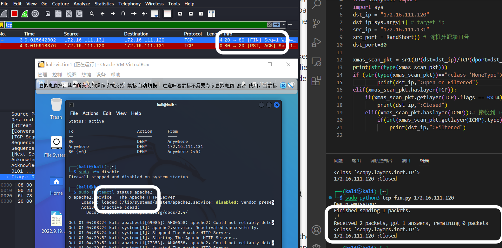
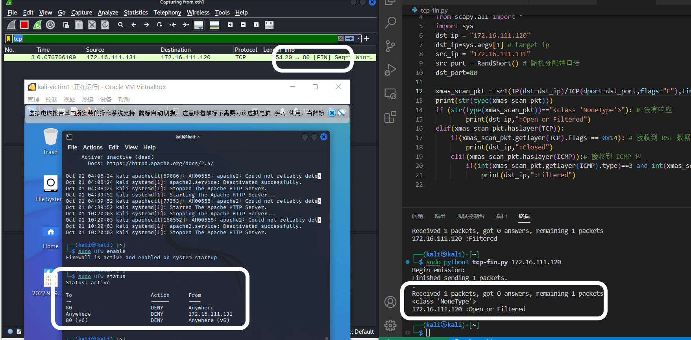

# 实验五 基于 Scapy 编写端口扫描器

## 实验目的

* 掌握网络扫描之端口状态探测的基本原理

## 实验环境
python + scapy

## 实验要求

* 完成以下扫描技术的编程实现
    * [x] TCP connect scan / TCP stealth scan
    * [x] TCP Xmas scan / TCP fin scan / TCP null scan
    * [x] UDP scan
* [x] 上述每种扫描技术的实现测试均需要测试端口状态为：开放、关闭 和 过滤 状态时的程序执行结果
* [x] 提供每一次扫描测试的抓包结果并分析与课本中的扫描方法原理是否相符？如果不同，试分析原因
* [x] 在实验报告中详细说明实验网络环境拓扑、被测试 IP 的端口状态是如何模拟的
* [x] 复刻 nmap 的上述扫描技术实现的命令行参数开关

## 实验网络环境拓扑

* Attacker kali
  172.16.111.131
* Target kali
  172.16.111.120
* gateway Debain
  172.16.111.1

## IP 的端口状态模拟

* UDP 端口：
  * ```shell
      # 在 target 主机开启 8080 端口
      nc -l -u -p 8080 
      # 局域网内其他主机可通过该操作向端口发送数据报，但是不会收到回复
      nc 172.16.111.120 -u 8080

      # 在 target 主机开启 8080 端口
      nc -l -u -p 8080 < /etc/passwd
      # 局域网内其他主机可通过该操作向端口发送数据报，会收到一个响应报
      nc 172.16.111.120 -u 8080
    ```
* 开放的端口：Target 开启 apache2 服务，端口号为 80
  * ```shell
      sudo systemctl start apache2
      sudo systemctl status apache2
    ```
* 关闭的端口：Target 关闭 apache2 服务，Attacker 扫描 80 端口
* 过滤状态：开启防火墙设置
  * ```shell
      sudo apt install ufw
      sudo ufw enable
      ufw deny 80
      sudo ufw default deny
      ``` 

## 实验过程

### TCP connect scan

* 课本原理如下：
  * Attacker 首先发送一个 SYN 数据包到目标主机端口
  * 如果接收到数据包，对数据包进行分析
    * 接收到 SYN/ACK 数据包：判断端口为开放状态，发送 ACK/RST 数据包
    * 接收到 RST/ACK 数据包：判断端口为关闭状态
  * 如果没有响应：被过滤

* 编写代码
* ```python
  
    # -*-coding:utf-8 -*-
    #! /usr/bin/python3

  from scapy.all import *
  import sys
 
  print('参数个数为:', len(sys.argv), '个参数。')
  print('参数列表:', str(sys.argv))

  dst_ip = "172.16.111.120"
  dst_ip=sys.argv[1] # target ip
  src_ip = "172.16.111.131"
  src_port = RandShort() # 随机分配端口号
  dst_port=80

  tcp_connect_scan_pkt = sr1(IP(src=src_ip,dst=dst_ip)/TCP(sport=src_port,dport=dst_port,flags="S"),timeout=10)    #SYN #只接受一个回复的数据包
  if(str(type(tcp_connect_scan_pkt))=="<class 'NoneType'>"): # 无回应
    print(dst_ip,":Filtered")
  elif(tcp_connect_scan_pkt.haslayer(TCP)):
    if(tcp_connect_scan_pkt.getlayer(TCP).flags == 0x12): # 收到 SYN/ACK
        send_rst = sr(IP(dst=dst_ip)/TCP(sport=src_port,dport=dst_port,flags="AR"),timeout=10)   # 发送 RST/ACK 包
        print(dst_ip,":Open")
    elif(tcp_connect_scan_pkt.getlayer(TCP).flags == 0x14): # RST
        print(dst_ip,":Closed")

    ```
* attacker 运行代码`python3 tcp-scan.py 172.16.111.120`，使用wireshark 抓包，查看结果与抓包结果
  * tcp 端口开放：可以看到 Attacker 发送 SYN 的TCP 数据包后， 80 端口进行握手回复了 SYN/ACK 数据报；Attacker 回复 RST 数据报，80 端口回复 RST/ACK 数据报。
  * 
  * 
  * tcp 端口关闭：可以看到 Attacker 发送 SYN 的TCP 数据包后， 80 端口关闭回复了 RST/ACK 数据报。
  * 
  * 
  * 开启防火墙： 可以看到 Attacker 发送 SYN 的TCP 数据包后， 80 端口无回应。
  * 

### TCP stealth scan

* 课本原理如下：
  * Attacker 首先发送一个 SYN 数据包到目标主机端口
  * 如果接收到数据包，对数据包进行分析
    * 接收到 SYN/ACK 数据包：判断端口为开放状态，发送 RST 数据包
    * 接收到 RST/ACK 数据包：判断端口为关闭状态
  * 如果没有响应：被过滤
  * TCP stealth scan 与 TCP connect scan 的不同点在于收到 SYN/ACK 数据包后的回复策略，TCP stealth scan 为了躲避防火墙的探测

* 编写代码
* ```python
  
    # -*-coding:utf-8 -*-
    #! /usr/bin/python3

  from scapy.all import *
  import sys
 
  print('参数个数为:', len(sys.argv), '个参数。')
  print('参数列表:', str(sys.argv))

  dst_ip = "172.16.111.120"
  dst_ip=sys.argv[1] # target ip
  src_ip = "172.16.111.131"
  src_port = RandShort() # 随机分配端口号
  dst_port=80

  tcp_stealth_scan_pkt = sr1(IP(src=src_ip,dst=dst_ip)/TCP(sport=src_port,dport=dst_port,flags="S"),timeout=10)    #SYN #只接受一个回复的数据包
  if(str(type(tcp_stealth_scan_pkt))=="<class 'NoneType'>"): # 无回应
    print(dst_ip,":Filtered")
  elif(tcp_stealth_scan_pkt.haslayer(TCP)):
    if(tcp_stealth_scan_pkt.getlayer(TCP).flags == 0x12): # 收到 SYN/ACK
        send_rst = sr(IP(dst=dst_ip)/TCP(sport=src_port,dport=dst_port,flags="R"),timeout=10)   # 发送 RST 包
        print(dst_ip,":Open")
    elif(tcp_stealth_scan_pkt.getlayer(TCP).flags == 0x14): # RST
        print(dst_ip,":Closed")

    ```
* attacker 运行代码`python3 tcp-stealth.py 172.16.111.120`，使用wireshark 抓包，查看结果与抓包结果
  * tcp 端口开放：可以看到 Attacker 发送 SYN 的TCP 数据包后， 80 端口进行握手回复了 SYN/ACK 数据报；Attacker 回复 RST 数据报。
  * 
  * tcp 端口关闭：可以看到 Attacker 发送 SYN 的TCP 数据包后， 80 端口关闭回复了 RST/ACK 数据报。
  * 
  * 开启防火墙：可以看到 Attacker 发送 SYN 的TCP 数据包后， 80 端口无回应。
  * 

### TCP Xmas scan

* 课本原理如下：
  * Attacker 发送一个 TCP 数据包到目标主机端口，并对 TCP 报文头 FIN URG PUSH 标记进行设置
  * 如果接收到数据包，对数据包进行分析
    * 接收到 RST 数据包，则端口状态为关闭
  * 如果没有响应，则端口状态为开放或过滤
* 编写代码
* ```python
  
  # -*-coding:utf-8 -*-
    #! /usr/bin/python3

  from scapy.all import *
  import sys
  dst_ip = "172.16.111.120"
  dst_ip=sys.argv[1] # target ip
  src_ip = "172.16.111.131"
  src_port = RandShort() # 随机分配端口号
  dst_port=80

  xmas_scan_pkt = sr1(IP(dst=dst_ip)/TCP(dport=dst_port,flags="FPU"),timeout=10) #发送一个 TCP 数据包到目标主机端口，并对 TCP 报文头 FIN URG PUSH 标记进行设置
  print(str(type(xmas_scan_pkt)))
  if (str(type(xmas_scan_pkt))=="<class 'NoneType'>"): # 没有响应
        print(dst_ip,":Open or Filtered")
  elif(xmas_scan_pkt.haslayer(TCP)):
    if(xmas_scan_pkt.getlayer(TCP).flags == 0x14): # 接收到 RST 数据包
        print(dst_ip,":Closed")
    elif(xmas_scan_pkt.haslayer(ICMP)):# 接收到 ICMP 包
        if(int(xmas_scan_pkt.getlayer(ICMP).type)==3 and int(xmas_scan_resp.getlayer(ICMP).code) in [1,2,3,9,10,13]):
            print(dst_ip,":Filtered")

    ```
* attacker 运行代码`python3 tcp-xmas.py 172.16.111.120`，使用wireshark 抓包，查看结果与抓包结果
  * tcp 端口开放：可以看到 Attacker 发送一个 TCP 数据包 FIN URG PUSH 标记进行设置，80 端口无回应。
  * 
  * tcp 端口关闭：可以看到 Attacker 发送一个 TCP 数据包 FIN URG PUSH 标记进行设置，80 端口回复 RST/ACK TCP 数据报。
  * 
  * 开启防火墙：可以看到 Attacker 发送一个 TCP 数据包 FIN URG PUSH 标记进行设置，80 端口无回应。
  * 

### TCP fin scan 

* 课本原理如下：
  * Attacker 发送一个 TCP FIN 数据包到目标主机端口
  * 如果接收到数据包，对数据包进行分析
    * 接收到 RST 数据包，则端口状态为关闭
  * 如果没有响应，则端口状态为开放或者被过滤
* 编写代码
* ```python
  
  # -*-coding:utf-8 -*-
    #! /usr/bin/python3

  from scapy.all import *
  import sys
  dst_ip = "172.16.111.120"
  dst_ip=sys.argv[1] # target ip
  src_ip = "172.16.111.131"
  src_port = RandShort() # 随机分配端口号
  dst_port=80

  fin_scan_pkt = sr1(IP(dst=dst_ip)/TCP(dport=dst_port,flags="F"),timeout=10) #发送一个 TCP 数据包到目标主机端口，并对 TCP 报文头 FIN URG PUSH 标记进行设置
  print(str(type(fin_scan_pkt)))
  if (str(type(fin_scan_pkt))=="<class 'NoneType'>"): # 没有响应
        print(dst_ip,":Open or Filtered")
  elif(fin_scan_pkt.haslayer(TCP)):
    if(fin_scan_pkt.getlayer(TCP).flags == 0x14): # 接收到 RST 数据包
        print(dst_ip,":Closed")
    elif(fin_scan_pkt.haslayer(ICMP)):# 接收到 ICMP 包
        if(int(fin_scan_pkt.getlayer(ICMP).type)==3 and int(fin_scan_resp.getlayer(ICMP).code) in [1,2,3,9,10,13]):
            print(dst_ip,":Filtered")

    ```
* attacker 运行代码`python3 tcp-fin.py 172.16.111.120`，使用wireshark 抓包，查看结果与抓包结果
  * tcp 端口开放：可以看到 Attacker 发送一个 TCP 数据包 FIN 标记进行设置，80 端口无回应。
  * 
  * tcp 端口关闭：可以看到 Attacker 发送一个 TCP 数据包 FIN 标记进行设置，80 端口回复 RST/ACK TCP 数据报。
  * 
  * 开启防火墙：可以看到 Attacker 发送一个 TCP 数据包 FIN 标记进行设置，80 端口无回应。 
  * 

### TCP null scan

* 课本原理如下：
  * Attacker 发送一个 TCP 数据包到目标主机端口，且 TCP 报文头未进行 Flag 设置
  * 如果接收到数据包，对数据包进行分析
    * 接收到 RST 数据包，则端口状态为关闭
  * 如果没有响应，则端口状态为开放或过滤
* 编写代码
* ```python
  
  # -*-coding:utf-8 -*-
    #! /usr/bin/python3

  from scapy.all import *
  import sys
  dst_ip = "172.16.111.120"
  dst_ip=sys.argv[1] # target ip
  src_ip = "172.16.111.131"
  src_port = RandShort() # 随机分配端口号
  dst_port=80

  xmas_scan_pkt = sr1(IP(dst=dst_ip)/TCP(dport=dst_port,flags=""),timeout=10) #发送一个 TCP 数据包到目标主机端口，并对 TCP 报文头 FIN URG PUSH 标记进行设置
  print(str(type(xmas_scan_pkt)))
  if (str(type(xmas_scan_pkt))=="<class 'NoneType'>"): # 没有响应
        print(dst_ip,":Open or Filtered")
  elif(xmas_scan_pkt.haslayer(TCP)):
    if(xmas_scan_pkt.getlayer(TCP).flags == 0x14): # 接收到 RST 数据包
        print(dst_ip,":Closed")
    elif(xmas_scan_pkt.haslayer(ICMP)):# 接收到 ICMP 包
        if(int(xmas_scan_pkt.getlayer(ICMP).type)==3 and int(xmas_scan_resp.getlayer(ICMP).code) in [1,2,3,9,10,13]):
            print(dst_ip,":Filtered")

    ```
* attacker 运行代码`python3 tcp-null.py 172.16.111.120`，使用wireshark 抓包，查看结果与抓包结果
  * tcp 端口开放：可以看到 Attacker 发送一个 TCP 数据包 FLAG 标记为空，80 端口无回应。
  * 
  * tcp 端口关闭：可以看到 Attacker 发送一个 TCP 数据包 FLAG 标记为空，80 端口回应 RST/ACK TCP 数据报。
  * 
  * 开启防火墙：可以看到 Attacker 发送一个 TCP 数据包 FLAG 标记为空，80 端口无回应。 
  * 

### UDP scan

* 课本原理如下：
  * Attacker 发送一个零字节的 UDP 数据包到目标主机端口
  * 如果收到一个 ICMP 不可到达的回应，那么则认为这个端口是关闭的
  * 对于没有回应的端口则认为是
    * 开放的
    * 但是如果目标主机安装有防火墙或其它可以过滤数据包的软硬件,将可能得不到任何回应
* 编写代码
* ```python
  
    # -*-coding:utf-8 -*-
    #! /usr/bin/python3


    dst_ip = "172.16.111.120"
    src_ip = "172.16.111.131"
    src_port = RandShort()

    dst_port=8080
    dst_timeout=10

    udp_scan_pkt = sr1(IP(dst=dst_ip)/UDP(dport=dst_port),timeout=dst_timeout) #发送 UDP 数据包
    print(str(type(xmas_scan_pkt)))
    if (str(type(xmas_scan_pkt))=="<class 'NoneType'>"): # 没有响应
        print(dst_ip,":Open or Filtered")
    elif(udp_scan_pkt.haslayer(UDP)):
        print(dst_ip,":open")
    elif(udp_scan_pkt.haslayer(ICMP)):
      if(int(udp_scan_pkt.getlayer(ICMP).type)==3 and int(udp_scan_pkt.getlayer(ICMP).code)==3): # 接收到 RST 数据包
        print(dst_ip,":Closed")
      elif(int(udp_scan_pkt.getlayer(ICMP).type)==3 and int(udp_scan_pkt.getlayer(ICMP).code) in [1,2,9,10,13]):# 接收到 ICMP 包
        print(dst_ip,":closed")
    else:
      print(dst_ip,str(type(udp_scan_resp)))

    ```
* attacker 运行代码`python3 udp-scan.py 172.16.111.120`，使用wireshark 抓包，查看结果与抓包结果
  * udp 端口开放：Attacker 发送一个零字节 UDP 数据报，8080 端口无回应。
  * 
  * udp 端口关闭：Attacker 发送一个零字节 UDP 数据报，收到 ICMP 不可到达的回应。
  * 
  * 开启防火墙：Attacker 发送一个零字节 UDP 数据报，8080 端口无回应。 
  * 

### 复刻 nmap 扫描技术实现的命令行参数开关

* nmap 命令行参数开关
  ```shell
    nmap -sF 172.16.111.120 # FIN
    nmap -sX 172.16.111.120 # Xmas
    nmap -sN 172.16.111.120 # Null
    nmap -sS 172.16.111.120 # TCP 半开扫描
    nmap -sU 172.16.111.120 # UDP 扫描
    ```

* ```python
  
    # -*-coding:utf-8 -*-
    #! /usr/bin/python3
    import sys
    from scapy.all import *
    import getopt

    
    def udp_scan(dst_ip): # 使用上述实验过程中编写的 python 代码，参数为 ip 地址, 代码扫描 80/8080/443/53 等端口

    def xmas_scan(dst_ip):

    def fin_scan(dst_ip):

    def null_scan(dst_ip):

    def stealth_scan(dst_ip):


    def main(argv):
    dst_ip = ''
    try:
        opts, args = getopt.getopt(argv, 'h', ['help','sF=',
        'sX=','sN=','sS=','sU='])
        '''
        h后面没有冒号，表示后面不带参数；
        help后面没有冒号，表示后面不带参数；
        其他两个有=，表示后面需要参数
        '''
        # print("opts:{},\targs:{}".format(opts, args))
    except getopt.GetoptError:
        print('Usage:   test.py -i <inputfile> -o <outputfile>')
        sys.exit(2)
    for opt, arg in opts:
        if opt == '-h':
            print('test.py --sF/--sX/--sN/--sS/--sU <dst_ip> ')
            sys.exit()
        elif opt in ("--sF"):
            dst_ip  = arg
            fin_scan(dst_ip)
        elif opt in ("--sX"):
            dst_ip  = arg
            xmas_scan(dst_ip)
        elif opt in ("--sN"):
            dst_ip  = arg
            null_scan(dst_ip)
        elif opt in ("--sS"):
            dst_ip  = arg
            stleath_scan(dst_ip)
        elif opt in ("--sU"):
            dst_ip  = arg
            udp_scan(dst_ip)


  if __name__ == "__main__":
    # print(sys.argv[1:])
    main(sys.argv[1:])

    ```
* 

## 遇到的问题
* 如何开启防火墙设置
  * ```shell
      # 错误的开启方式
      sudo systemctl start ufw
      sudo status ufw
      # inactive

      # 正确的开启方式
      sudo ufw enable
    ``` 
## 参考文献
* [port-scanning-using-scapy](https://resources.infosecinstitute.com/topic/port-scanning-using-scapy/)