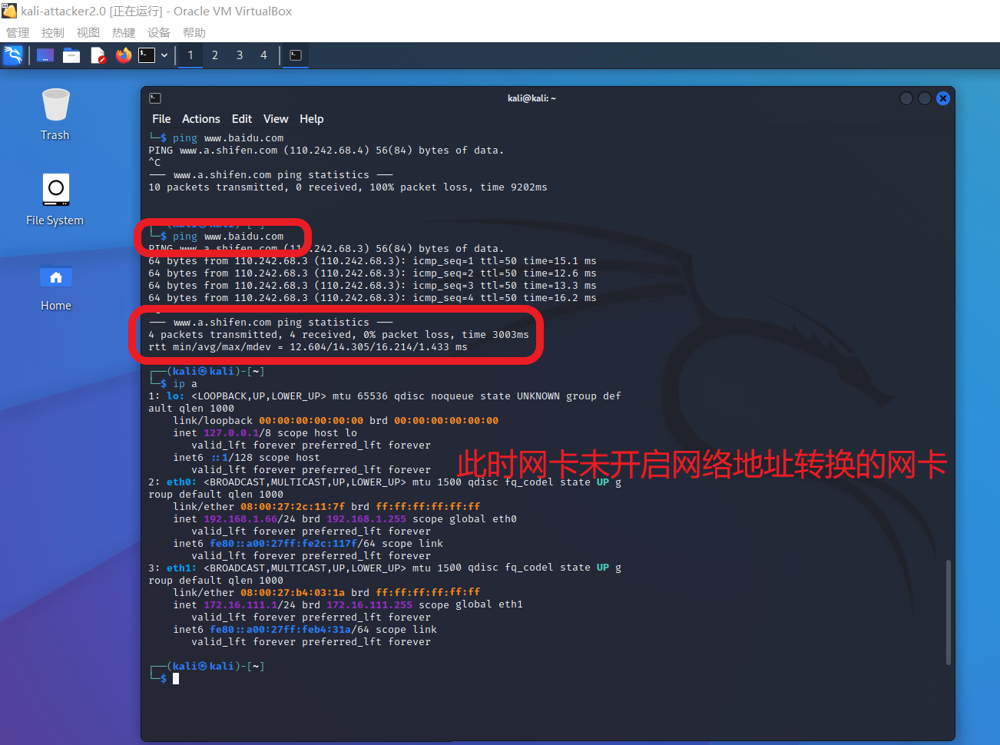
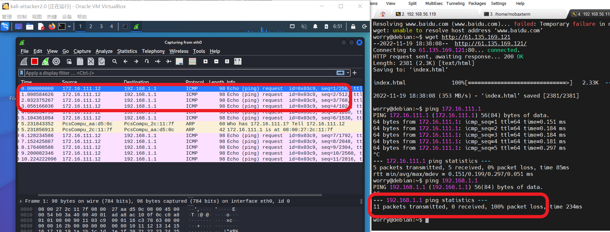

# 第八章实验 防火墙

## 实验环境

* 网关：ubuntu 20.04 enp0s8：192.168.1.1
* host-1：debain enp0s9：172.16.111.12
* host-2：kali eth0：192.168.1.66 eth0:0 172.16.111.1
* host-3：kali eth0：172.16.111.120

## 实验网络拓扑图

分析可得该局域网内有两个内部网络，一个是 `172.16.111.0/24`，一个是`192.168.1.0/24`,网关可以直接访问互联网，所以有一个 ip 地址可以在互联网中通信，因此要设置额外的网卡（NAT）来实现互联网通信。网关作为该局域网范围内的 DNS 服务器，需要开启 DNS 服务。

```
+----------------------+          +-------------------------+       +----------------------+     
|     host-1           |          |   host-2                |       |     host-3           |  
|     172.16.111.12     |          |   eth0:0 172.16.111.1    |       |     172.16.111.120     |  
|                      |          |   eth0: 192.168.1.66   |       |                      |  
+-------------+--------+          +----------+--------------+       +-------------+--------+  
              |                              |                                    |
              |                              |                                    |
     +--------+------------------------------+--+                                 |
     |                交换机                    |---------------------------------+
     +-----------------+------------------------+
                       |
                       |
                 +-----+-----------+
                 |   eth0          |   `
                 |   192.168.1.1   |
              +--+-----------------+---------+
              |                              |
              |        host-gw / dns-svr     |
              |                              |
              +------------------+----------++
                                 |  eth1    |
                                 +----------+
```

## 实验任务

* [X] 请对实验提供脚本逐行添加代码注释
* [X] host-1可以ping通ip: 172.16.111.1 吗？
* [X] host-1可以ping通ip: 192.168.1.1 吗？
* [X] host-1可以ping通域名: `www.baidu.com` 吗？
* [X] host-1可以访问： `http://www.baidu.com `吗？
* [X] host-1可以访问：`http://61.135.169.121` 吗？
* [X] host-3可以ping通ip: 172.16.111.1 吗？
* [X] host-3可以ping通ip: 192.168.1.1吗？
* [X] shost-3可以访问互联网吗？

## 实验步骤

### 网络拓扑配置

#### 网关

* 网卡1 NAT ：保证可以访问互联网
* 网卡2 开启内部网络 intnet0：与 host-2 和在同一内部网络内
  ```shell
  # ubuntu 20.04 网卡配置静态地址

  sudo vim /etc/netplan/00-installer-config.yaml

  # 具体修改内容如下
  # network:
  #   ethernets:
  #      enp0s3:
  #        dhcp4: true
  #      enp0s8:
  #        addresses: [192.168.1.1/24]
  #        dhcp4: false
  #      enp0s9:
  #        dhcp4: true
  #    version: 2

  # 使 netplan 生效

  sudo netplan apply

  # 查看网卡 ip
  ip a
  ```
  
  

  

* 网关开启 DNS 解析服务器，正常提供域名解析服务
  ```shell
  # ubuntu 20.04 开启 DNS 服务
  
  sudo apt install bind9 -y

  # 开启服务

  sudo systemctl start bind9

  # 查看状态

  sudo systemctl status bind9
  ```
* 可以成功访问互联网

  

* 配置 iptables NAT 表
  ```shell
  # 文件在当前目录下
  sudo iptables-save -c > iptables.rules

  cp iptables.rules iptables.rules.bak

  # 将定义好的规则保存在 iptables.rules 文件中，在 NAT 表中添加如下规则
  # 对处于 192.168.1.0/24 和 172.16.111.0/24 网段的主机的转发包进行 NAT 转换

  sudo iptables -t nat -A POSTROUTING -s 192.168.1.0/24 ! -d 192.168.1.0/24 -o enp0s3 -j MASQUERADE
  sudo iptables -t nat -A POSTROUTING -s 172.16.111.0/24 ! -d 172.16.111.0/24 -o enp0s3 -j MASQUERADE
  
  # 查看规则是否设置成功
  iptables -L -n
  ```
* 关闭防火墙
  ```shell
  # 如果之前开启了 ufw
  sudo ufw disable
  ```

#### host-2

* 网卡1 开启内部网络 intnet0：与网关在同一内部网络中
* 实现 eth0:0 ：与 host-1 和 host-3 在同一内部网络中
* eth0:0 为子网卡：子网卡并不是实际上的网络接口设备，但是可以作为网络接口在系统中出现。虽然可以与物理网卡的网络接口同时在系统中存在并使用不同的 IP 地址，而且也拥有它们自己的网络接口配置文件，但是eth0:0 必须要依赖于物理网卡，当所依赖的物理网卡不启用时（Down状态），子网卡也将一同不能工作。
* 配置操作如下
  ```shell
  # kali 网卡配置静态地址

  sudo vim /etc/network/interfaces

  # 具体修改内容如下
  # auto lo
  # iface lo inet loopback
  # auto eth0
  # iface eth0 inet static
  # address 192.168.1.66
  # netmask 255.255.255.0
  # gateway 192.168.1.1

  # 使 netplan 生效
  # 也可以使用图形化界面进行配置
  sudo netplan apply

  # 临时性为网卡加入新的 IP 地址:
  ifconfig eth0:0 172.16.111.1 netmask 255.255.255.0 up
  # 查看网卡 ip
  ip a
  ```


* 配置 192.168.1.1 为默认网关,网关为域名解析服务器

  

* 可以访问互联网
  
  

* 开启 ipv4 转发
  host-2 作为内部网络 172.16.111.0/24 网段的网关需要具有转发功能
  ```shell
    # 查看/proc文件系统,以确定 IP 转发功能的状态
    cat /proc/sys/net/ipv4/ip_forward

    # 返回值为 0，代表本机未开启 IP 转发功能
    # 如果为 1 ，代表已开启
    # 暂时打开 ip 转发功能
    sudo su
    echo 1 > /proc/sys/net/ipv4/ip_forward
    
    # 永久修改IP转发，需要修改 /etc/sysctl.conf 文件，修改如下： `net.ipv4.ip_forward = 1` 
    #  也可以执行下面的命令来使修改生效： `sysctl -p /etc/sysctl.conf` 进行了上面的配置后，就能一直开启IP转发功能了。
  ```

* 配置 nat 表
  ```shell
    sudo iptables-save -c > iptables.rules

    cp iptables.rules iptables.rules.bak
    
    sudo iptables -t nat -A POSTROUTING -s 172.16.111.0/24 ! -d 172.16.111.0/24 -o eth0 -j MASQUERADE

    # 查看规则是否设置成功
    iptables -L -n -t
  ```
  配置好后，host-1 可以通过其默认网关 host-2 ping 通 192.168.1.1 的主机
  
  

* 运行实验脚本配置 iptable 表
* 注意脚本运行后，需要重新配置一下 nat 表

#### host-1 与 host-3

* host-1 配置：
  * 网卡1 开启内部网络 intnet0
* host-3 配置：
  * 网卡1 开启内部网络 intnet0
* host-1和host-3 配置 host-2 为默认网关，网关为域名解析服务器

#### host-3 kali

* 配置网关以及内部网络 ip 地址 
    ```shell
  sudo vim /etc/network/interfaces

  # 具体修改内容如下
  # auto lo
  # iface lo inet loopback
  # auto eth0
  # iface eth0 inet static
  # address 172.16.111.120
  # netmask 255.255.255.0
  # gateway 192.168.1.1

  # 使 netplan 生效
  # 也可以使用图形化界面进行配置
  sudo netplan apply
  ```

#### host-1 debian 

* 配置网关以及内部网络 ip 地址 
    ```shell
    cp /etc/network/interfaces /etc/network/interfaces.bak
    sudo vi /etc/network/interfaces

    # 修改为以下内容
    # The loopback network interface
    auto lo
    iface lo inet loopback

    # The primary network interface
    allow-hotplug enp0s3
    iface enp0s3 inet dhcp
    allow-hotplug enp0s8
    iface enp0s8 inet dhcp
    allow-hotplug enp0s9
    iface enp0s9 inet static
        address 172.16.111.12
        netmask 255.255.255.0
        gateway 172.16.111.1
        dns-nameservers 192.168.1.1
    
    systemctl restart networking
    service networking restart
    ```

    

* 配置默认 DNS 解析服务器
  ```shell
    # 临时修改
  # 进入/etc/resolvconf/run/interface/文件夹
    sudo vi /etc/resolv.conf
    # 添加nameserver
    nameserver 192.168.1.1

    # 永久修改
    sudo vi /etc/dhcp/dhclient.conf

    # 添加以下内容

    supersede domain-name-servers 192.168.1.1；
    
    ```

### 分析脚本及配置脚本文件

#### host-2 iptables 配置脚本

```shell
#!/bin/bash

# iptables 的默认路径
IPT="/sbin/iptables"

# Flush old rules, old custom tables
$IPT --flush
$IPT --delete-chain

# 定义 输入链，输出链和转发链的默认策略
## 输入链的默认策略是丢弃
$IPT -P INPUT DROP
## 转发链的默认策略是丢弃
$IPT -P FORWARD DROP
## 输出链的默认策略是接受
$IPT -P OUTPUT ACCEPT

#
$IPT -N forward_demo
$IPT -N icmp_demo

# 对回环地址的数据流通完全开放
# 在 INPUT 规则列表的最后增加 1 条规则：
# 对从回环地址进入的数据包进行接受的操作
$IPT -A INPUT -i lo -j ACCEPT
# 在 OUTPUT 规则列表的最后增加 1 条规则：
# 对从回环地址输出的数据包进行接受的操作
$IPT -A OUTPUT -o lo -j ACCEPT

# 在 INPUT 规则列表的最后增加 1 条规则：
# 针对 TCP 协议类型的数据包，所有的 TCP 通信数据包都应该以 SYN 三次握手开始，否则丢弃
$IPT -A INPUT -p tcp ! --syn -m state --state NEW -s 0.0.0.0/0 -j DROP

# 接收所有已建立链接的数据包
$IPT -A INPUT -m state --state ESTABLISHED,RELATED -j ACCEPT

# 对所有的输入的 icmp 包都执行 icmp_demo 链的规则
$IPT -A INPUT -p icmp -j icmp_demo

# 对 icmp_demo 规则添加新的规则：
# 接收从 eth0 网卡输入的 icmp 数据包
# 回到触发跳转 icmp_demo 链的规则
$IPT -A icmp_demo -p icmp -i eth0 -j ACCEPT
$IPT -A icmp_demo -j RETURN

# 对转发链添加 jump 规则 forward_demo
$IPT -A FORWARD -j forward_demo

# 在 forward_demo 链添加规则
# 触发了forward_demo 链的规则就在 log 中记录并添加前缀 FORWARD_DEMO
$IPT -A forward_demo -j LOG --log-prefix FORWARD_DEMO
# 对目的端口为 80 的使用 tcp 协议且应用层字符串含'baidu'的数据包进行丢弃
$IPT -A forward_demo -p tcp --dport 80 -m string --algo bm --string 'baidu' -j DROP
# 转发源地址为 172.16.111.12 的 tcp 数据包
$IPT -A forward_demo -p tcp -s 172.16.111.12 -j ACCEPT
# 转发目的地址为 172.16.111.12 的 tcp 数据包
$IPT -A forward_demo -p tcp -d 172.16.111.12 -j ACCEPT
# 转发目的地址为 172.16.111.12 ，目的端口为 53 的 udp 数据包
$IPT -A forward_demo -p udp -s 172.16.111.12 --dport 53 -j ACCEPT
# 转发源地址为 172.16.111.1 的 ，目的端口为 53 的 udp 数据包
$IPT -A forward_demo -p udp -s 172.16.111.1  --dport 53 -j ACCEPT
# 转发源地址为 192.168.56.1 的 ，源端口为 53 的 udp 数据包
$IPT -A forward_demo -p udp -s 192.168.56.1  --sport 53 -j ACCEPT
# 转发源地址为 172.16.111.1 的 tcp 数据包
$IPT -A forward_demo -p tcp -s 172.16.111.1 -j ACCEPT
# 触发 forward_demo 链的源地址为 172.16.111.1 的数据包返回原来的链
$IPT -A forward_demo -s 172.16.111.1 -j RETURN

# 在 nat 表中 POSTROUTING 链添加规则，对源地址为 172.16.111.110/24 的输出数据包开启 nat 转发并动态分配 ip 地址
$IPT -t nat -A POSTROUTING -s 172.16.111.0/24 -o eth0 -j MASQUERADE
```
### 实验问题验证

#### host-1 可以 ping 通 ip: 172.16.111.1 吗？

* 可以
* 如下图所示，在 host-1 上使用 `ping 172.16.111.1` 操作，在 host-2 上进行抓包。抓包结果可见收到 icmp 包并对其回复。

  

#### host-1 可以 ping 通 ip: 192.168.1.1 吗？

* 不可以
* 如下图所示，在 host-1 上使用 `ping 192.168.1.1` 操作，丢包率 100% 在 host-2 上进行抓包。抓包结果可见看到由 host-1 发出的目的地址为 192.168.1.1的 icmp 包，但是并没有 icmp 响应包，由此可见 host-2 的防火墙规则对源地址为 172.16.111.12，目的地址为 192.168.1.0/24 网段的 icmp 包进行了丢弃。
  
  

#### host-1 可以 ping 通域名: `www.baidu.com` 吗？

* 不可以
* 按照规则，host-1 通过 host-2 向 `192.168.1.1` 发起 DNS 解析包进行解析，host-2 进行 nat 转换，转发，然后收到 `192.168.1.1` 的回复包，再进行 nat 转换，转发给 host-1；host-1 收到解析结果后发送 icmp 包，由于应用层字符串含'baidu'的数据包，触发规则被丢弃。
* 实际抓包结果如下图所示，在 host-1 上使用 `ping www.baidu.com` 抓包结果可见看到由 host-1 发出 DNS 解析的 UDP 数据包，并得到回复；host-1 发送 icmp 数据包，但未收到响应包。虽然在 host-2 的抓包结果中可以看到 host-1 发出的 icmp 包，但是在转发时，host-2 进行了丢弃处理
  
  

#### host-1可以访问： `http://www.baidu.com `吗？

* 不可以，实验时采用 `wget http://www.baidu.com` 命令
* 按照规则，host-1 通过 host-2 向 `192.168.1.1` 发起 DNS 解析包进行解析，host-2 进行 nat 转换，转发，然后收到 `192.168.1.1` 的回复包，再进行 nat 转换，转发给 host-1；host-1 收到解析结果后发送应用层协议为 http，传输层协议为 tcp 的数据包，由于应用层字符串含'baidu'的数据包，触发规则被丢弃。
* 实际抓包结果如下图所示，由 host-1 的抓包结果可见 host-1 正常进行 dns 解析，进行 tcp 连接，但是由于应用层字符串含'baidu'的数据包，触发规则被丢弃。tcp 请求数据包未收到回应，最后 tcp 连接关闭。
  
  

#### host-1可以访问：`http://61.135.169.121` 吗？

* 可以
* 按照规则，host-1 通过 host-2 向 `192.168.1.1` 发起 DNS 解析包进行解析，host-2 进行 nat 转换，转发，然后收到 `192.168.1.1` 的回复包，再进行 nat 转换，转发给 host-1；host-1 收到解析结果后发送应用层协议为 http，传输层协议为 tcp 的数据包，在规则中能够被转发。
* 如下图所示，由 host-1 的抓包结果可见 host-1 正常进行 dns 解析，进行 tcp 连接，发送 http 请求数据包，并收到回应。
  
  

#### host-3可以ping通ip: 172.16.111.1 吗？

* 可以
* 根据规则：host-3 和 host-2 处于同一内部网络 `172.16.111.0/24` 中， input 链对进入 eth0 网卡的 tcp 数据包和 icmp 数据包执行接收操作。
* 如下图所示，在 host-1 上使用 `ping 172.16.111.1` 操作，在 host-2 上进行抓包。抓包结果可见收到 icmp 包并对其回复。

  

#### host-3可以ping通ip: 192.168.1.1吗？

* 不可以
* 根据规则：转发链的策略默认为丢弃，在 forward_demo 规则中没有允许转发源地址为 `172.16.111.120` 的数据包的规则，所以执行默认策略丢弃。
* 如下图所示，在 host-1 上使用 `ping 172.16.111.1` 操作，在 host-2 上进行抓包。抓包结果可见收到 icmp 包并对其回复。

  

#### host-3可以访问互联网吗？

* 不可以
* 根据规则：转发链的策略默认为丢弃，在 forward_demo 规则中没有允许转发源地址为 `172.16.111.120` 的数据包的规则，所以执行默认策略丢弃。所以 host-3 无法进行 dns 域名解析，也无法访问互联网
* 如下图所示，在 host-1 上使用 `ping 172.16.111.1` 操作，在 host-2 上进行抓包。抓包结果可见收到 icmp 包并对其回复。

  

## 遇到的问题

* debian 网卡设置
  ```shell
    # root
    vi /etc/netplan/interfaces
    # 如果是使用了老师提供的 debian 虚拟机的话，会有配置好的网关的网络配置
    # 在本实验中无需这些配置，所以将改文件备份，然后编写一个新的文件
    cp interfaces interfaces.bak
    vi /etc/network/interfaces

    # 修改如下
    
    # The loopback network interface
    auto lo
    iface lo inet loopback

    # The primary network interface
    allow-hotplug enp0s3
    iface enp0s3 inet dhcp
    allow-hotplug enp0s8
    iface enp0s8 inet dhcp
    allow-hotplug enp0s9
    iface enp0s9 inet static
    address 172.16.111.12
    netmask 255.255.255.0

    systemctl restart networking

    ```


* 设置好 ubuntu 20.04 网卡后，出现无法联网的问题
  * 配置好了 NAT 网络，但是无法 `ping www.baidu.com`
  * 分析之前配置的 netplan 的配置文件，发现了问题
  ```shell
    # 原内容如下
  # network:
  #   ethernets:
  #      enp0s3:
  #        dhcp4: true
  #      enp0s8:
  #        addresses: [192.168.1.1/24]
  #        dhcp4: false
  #        gateway4: 192.168.1.1
  #      enp0s9:
  #        dhcp4: true
  #    version: 2

      # 去掉 gateway4：192.168.1.1 可以成功访问互联网
  ```

* host-2 无法成功访问互联网
  * 已成功开启网关的 dns 服务，并将其设置为默认网关
  * 网关需要配置 NAT 表来实现内部网络的主机访问互联网 

  