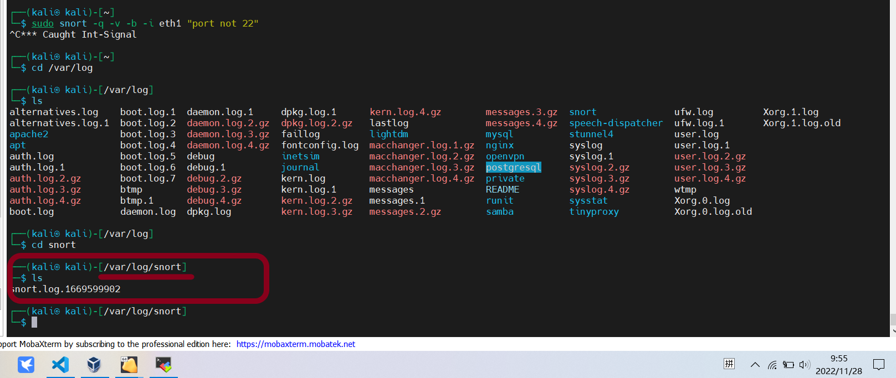
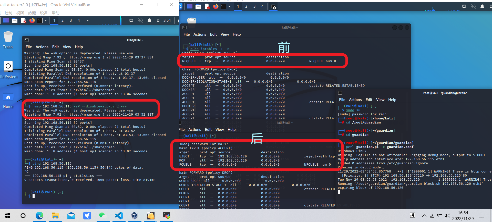

# 实验九 入侵检测

## 实验目的

## 实验任务

* [x] snort 实验一至四
* [x] 实验思考题一
* [x] Suricata 实验一至四
* [x] 配置 Suricata 为 IPS 模式，重复实验四

## 实验环境与拓扑

* kali victim eth1: 192.168.56.115
* kali attacker eth1: 192.168.56.120
 
## 实验步骤

### 安装 Snort

```shell
    
    sudo apt update
    # 禁止在apt安装时弹出交互式配置界面
    export DEBIAN_FRONTEND=noninteractive

    sudo apt install snort
```
### 实验一 配置 snort 为嗅探模式

```shell
    # 显示IP/TCP/UDP/ICMP头
    snort -v

    # 显示应用层数据
    snort -vd

    # 显示数据链路层报文头
    snort -vde
```


```shell
    # -b 参数表示报文存储格式为 tcpdump 格式文件
    # -q 静默操作，不显示版本欢迎信息和初始化信息
    snort -q -v -b -i eth1 "port not 22"
    # 文件保存在 /var/log/snort
    # 将文件保存为 .pcap 形式 适用wireshark 打开
```
* 文件存在 /var/log/snort 时，使用 wireshark 打开可能需要权限，这时可以将文件复制到其他目录然后修改文件权限。
  ```shell
  sudo cp <filename> home/kali/<filename2>
  sudo chmod 777 home/kali/<filename2>
  ```




### 实验二 配置并启用snort内置规则

```shell
    # /etc/snort/snort.conf 中的 HOME_NET 和 EXTERNAL_NET 需要正确定义
    sudo vim /etc/snort/snort.conf
    # 例如，本实验可以将上述两个变量值均设置为 any
    
    # -A 定义报警机制
    # -l 指定一个日志目录，snort就会自动记录数据包
    # -c 启用内置规则
    snort -q -A console -b -i eth1 -c /etc/snort/snort.conf -l /var/log
    /snort/
```


### 实验三 自定义snort规则
* 在 kali victim 上配置相关 snort 规则
```shell
    # 新建自定义 snort 规则文件
    # 对企图访问 http 服务器 /etc/passwd 的行为进行警报；一条是对使用 tcp 协议的每秒超过50次请求的行为进行警报。
    sudo vim /etc/snort/rules/http.rules
    # 写下以下内容
    alert tcp $EXTERNAL_NET any -> $HOME_NET 80 (msg:"WARNING! There is http connect! ";sid:1000001; rev:1;)

    # 添加配置代码到 /etc/snort/snort.conf
    sudo include $RULE_PATH/http.rules

```

* 在 victim 主机上开启 apache 服务，并开启 snort 监听
```shell
    sudo systemctl start apache2
    # -A fast：报警信息包括：一个时间戳(timestamp)、报警消息、源/目的IP地址和端口。
    snort -q -A fast -b -i eth1 -c /etc/snort/snort.conf -l /var/log/snort/

```
* 使用 attacker 进行访问，观察 /var/log/snort/alert 日志，可以看到有报警信息。
  
  

### 实验四 和防火墙联动

#### victim 准备步骤

* 下载并解压缩实验脚本代码
  ```shell
    cd /root/guardian
    # 下载脚本代码
    wget https://c4pr1c3.github.io/cuc-ns/chap0x09/attach/guardian.tar.gz
    # 解压缩 Guardian-1.7.tar.gz
    tar zxf guardian.tar.gz

    # 安装 Guardian 的依赖 lib
    apt install libperl4-corelibs-perl
  ```
* 先后开启 snort 和 guardian.pl
  ```shell
  # 开启 snort
    sudo su
    snort -q -A fast -b -i eth1 -c /etc/snort/snort.conf -l /var/log/snort/
    # 解压缩后文件均在 /root/guardian/guardian/ 下
    cd /root/guardian/guardian/   
    # 编辑 guardian.conf 并保存，确认以下2个参数的配置符合主机的实际环境参数。

    HostIpAddr      192.168.56.115
    Interface       eth1
    # 启动 guardian.pl
    perl guardian.pl -c guardian.conf
    ```

  
  
#### attacker 准备步骤
* 暴力扫描
  ```shell
    # -vv 列出详细扫描结果
    # -A 1-10000的端口ping扫描，操作系统扫描，脚本扫描，路由跟踪，服务探测。
    # -n 不对IP进行域名反向解析
    # -T[0-6]: Set timing template (higher is faster)
    nmap 192.168.56.115 -A -T4 -n -vv 
    ```
* 开始实验之前，VM-1 和 VM-2 可以互相双向访问。
  
  

* 观察实验后现象：可以看到 iptables 在开启实验前后确实有规则的增加，guardian 的日志中也记录了对暴力扫描的报警。
* attacker 使用 nmap 扫描，扫描成功，这也体现了入侵检测系统的特点，要现有攻击攻击发生了，才能进行入侵检测采取相应动作。nmap 扫描后， attacker 再试着 ping victim，会发现不发 ping 通，因为这时防火墙添加了规则，使得 ping 包无法通过。


### 安装 Suricata
```shell
    sudo apt install suricata 
```
### 实验一 配置 Suricata 为嗅探模式
```shell
# 修改 suricata.yaml 文件的 HOME_NET 和 EXTERNAL_NET 为 any
sudo vim /etc/suricata/suricata.yaml
# HOME_NET="any"
# EXTERNAL_NET = "any"

# 启动 suricata
sudo suricata -c /etc/suricata/suricata.yaml -i eth1
# 查看日志
cat /var/log/suricata/fast.log      
```


### 实验二 自定义 Suricata 规则并启用
* 配置访问内网主机 80 端口就报警的规则
```shell
    sudo vim /etc/snort/rules/http.rules
    # 写下以下内容
    alert tcp $EXTERNAL_NET any -> $HOME_NET 80 (msg:"WARNING! There is http connect! ";sid:1000001; rev:1;)

    # 添加配置代码到 /etc/snort/snort.conf
    rule-files:
       # - suricata.rules
        - http.rules
```
* 开启 apache 服务测试规则
```shell
    # 启动 apache2 服务
    sudo systemctl start apache2
    # 启动
    sudo suricata -c /etc/suricata/suricata.yaml -i eth1
    # 查看日志
    cat /var/log/suricata/fast.log    
```


### 实验三 和防火墙联动
* 先后开启 snort 和 guardian.pl
  ```shell
  # 开启 snort
    sudo su
    suricata -c /etc/suricata/suricata.yaml -i eth1
    # 解压缩后文件均在 /root/guardian/guardian/ 下
    cd /root/guardian/guardian/   
    # 修改 guardian.conf 文件
    # 在 alertFile 行将路径修改为 /var/log/suricata/fast.log
    perl guardian.pl -c guardian.conf
    ```

  

* 由于使用 nmap 扫描时 suricata 日志并未报警，因此配置自定义规则
  ```shell
    # 在 /etc/suricata/rules/ping.rules 写入以下
    alert icmp any any -> 192.168.56.115 any (msg: "NMAP ping sweep Scan"; dsize:0;sid:10000002; rev: 1;)
    # 在 在 /etc/suricata/suricata.conf 中加入该规则
  ```
#### attacker 准备步骤
* 暴力扫描
  ```shell
    # 使用 ping 方式暴力扫描
    nmap 192.168.56.115 -sP -vv
    ```

* 观察 iptables 规则在实验前后的区别，联动成功,与 snort 进行实验效果一致

  

### 实验四 配置 Suricata 为 IPS 模式和防火墙联动

* 配置 Suricata 为 IPS 模式
```shell
    # -q 表示以 IPS 模式运行
    sudo suricata -c /etc/suricata/suricata.yaml -q 0 

    # 还需配置 iptables，使得 suricata 可以访问到相应的数据包，通过防火墙的流量流经 suricata
    sudo iptables -I INPUT -p tcp -j NFQUEUE
    sudo iptables -I OUTPUT -p tcp -j NFQUEUE
```


* 重复实验四步骤，观察结果
* 可以看到与 IDS 模式不同的地方在于，IPS 模式可以选择是否接收或丢弃流经的流量




### 实验思考题
IDS与防火墙的联动防御方式相比IPS方式防御存在哪些缺陷？是否存在相比较而言的优势？
* IPS入侵防御（串行部署），IDS入侵检测（旁路部署）
* 缺陷：首先会让流量经过防火墙，然后才会和防火墙联动，它只能让入侵发生再进行防备。IDS只是在要保护的网络之外起到报警的作用，而不是直接在要保护的网络前面起到防御的作用。
* 相对而言的优势可能就是流量若是先经过防火墙再流入 IPS ，那么经过防火墙过滤后的流量特征与经过 IDS，未经过防火墙过滤的流量特征有所不同， IDS 进行检测判断时信息更完整。

## 遇到的问题
* kali apt install snort 报错
  ```shell
   # 报错信息
    [sudo] password for kali:
    Reading package lists... Done
    Building dependency tree... Done
    Reading state information... Done
    E: Unable to locate package snort

    # 添加 apt 源
    sudo vim /etc/apt/source.list
    # 添加源
    deb http://http.kali.org/kali sana main non-free contrib
    deb http://security.kali.org/kali-security sana/updates main contrib non-free
    deb http://old.kali.org/kali moto main non-free contrib

    ```
* suricata 实验四不成功，重复多次扫描，依旧不行
  * 原因是未触发 suricata 报警，查看 /var/log/suricata/fast.log
  * 修改 guardian 的 conf 文件，读取的日志应改为 /var/log/suricata/fast.log

## 参考链接

* [unable-to-locate-package-snort-kali](https://unix.stackexchange.com/questions/594935/unable-to-locate-package-snort-kali-linux-in-vmware-workstation-pro-ver-15-5-6)